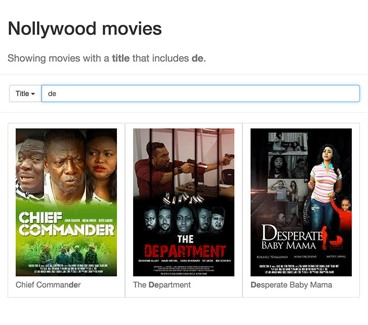

# Client-side filtering with AngularJS

A project for me to play with and learn
[AngularJS](https://angularjs.org).

The aim is to take a collection of movies, and only show the
items where a filter makes a match on the appropriate
property.



## To view it in action:

```
npm install client-side-filtering-with-angularjs
npm install --production
node dist/server.js
```

Then visit
[http://localhost:3000/filter.html](http://localhost:3000/filter.html)
in your browser.
